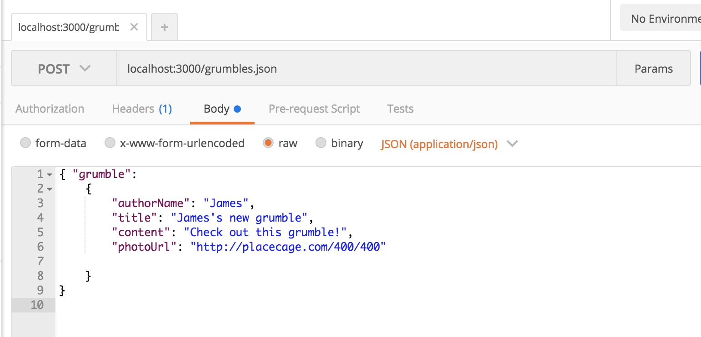
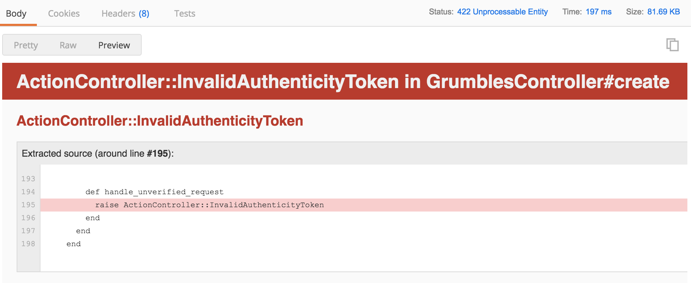
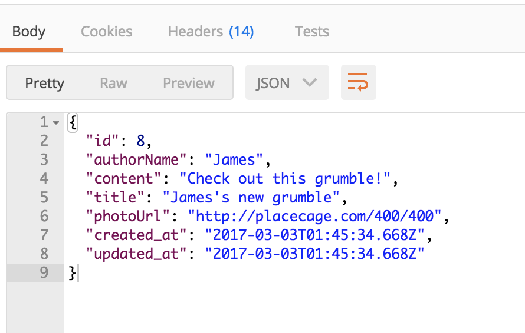

# APIs

## Learning Objectives

- Describe what an API is, and why we might use one.
- Use Postman to test an API.
- Describe the purpose and syntax of `respond_to`.
- Make a Rails app that provides a JSON API.

## Framing

In this lesson you will learn how to build a Rails API from the scratch and create a back-end that serves up JSON, in addition the usual HTML views. We will be focusing almost entirely on the back-end itself. To test our API, we will be using a very useful program called Postman.

## Introducing APIs (5 minutes / 0:05)

<details>
  <summary><strong>What is an API?</strong></summary>

  > An "Application Program Interface." While it technically applies to all of software design, the term has come to refer to web URLs that can be accessed for raw data.

</details>

<details>
  <summary><strong>How can we go about accessing an API within our programs?</strong></summary>

  > Using jQuery's AJAX method, Angular's ngResource or some other equivalent.

</details>

<details>
  <summary><strong>What information do we need to provide in order to be able to retrieve information from an API? What about for modifying data in an API?</strong></summary>

  > In order to "GET" or "DELETE" information, we need to provide a `url` `type` (HTTP method) and `dataType` (API data format). > In order to "POST" or "PUT", we also need to provide some `data`.

</details>

## API Exploration (5 minutes / 0:10)

> 3 minutes exercise. 2 minutes review.

We will spend some time accessing a couple 3rd party APIs. APIs vary quite a bit in their purposes and configurations. To get a sense of that, let's take a look at a few different APIs.

Form pairs and explore the API links in the below table. Record any observations that come to mind. In particular, think about what you see in the URL and the API response itself.

| API | Sample URL |
|-----|------------|
| **[This for That](http://itsthisforthat.com/)** | http://itsthisforthat.com/api.php?json |
| **[iTunes](https://www.apple.com/itunes/affiliates/resources/documentation/itunes-store-web-service-search-api.html)** | http://itunes.apple.com/search?term=adele |
| **[Giphy](https://github.com/Giphy/GiphyAPI)** | http://api.giphy.com/v1/gifs/search?q=funny+cat&api_key=dc6zaTOxFJmzC |
| **[OMDB API](http://www.omdbapi.com/)** | http://www.omdbapi.com/?t=Game%20of%20Thrones&Season=1 |
| **[StarWars](http://swapi.co/)** | http://swapi.co/api/people/3 |
| **[Stocks](http://dev.markitondemand.com/MODApis/)** | http://dev.markitondemand.com/Api/Quote/json?symbol=AAPL |

## A Closer Look at an API Request (5 minutes / 0:15)

Let's make a basic HTTP request to an API. While we can do this in the browser, we're going to use Postman - a Chrome plug-in for making HTTP requests - so we can not only look at it in more detail, but also make `POST` `PUT` and `DELETE` from the browser without building an app.  

#### Postman Setup

1. [Download Postman](https://www.getpostman.com/).  
2. Type in the "url" of an API call.  
3. Ensure the "method" is "GET".  
4. Press "Send".  

Here's an example of a successful `200 OK` API call...


And here's an example of an unsuccessful `403 Forbidden` API call. Why did it fail?


## Rails and JSON

### Intro (10 minutes / 0:25)

Today, we're going to use Rails to create our own API from which we can pull information. We will be using a familiar codebase, and modify it so that it can serve up data.  

Let's demonstrate using Grumblr. Clone down this [starter code](https://github.com/ga-wdi-exercises/grumblr_rails_api/) and checkout the `api-starter` branch...

```bash
$ git clone git@github.com:ga-wdi-exercises/grumblr_rails_api.git
$ cd grumblr_rails_api
$ git checkout api-starter
$ bundle install
$ rails db:create db:migrate db:seed
$ rails s
```

> The solution to today's code is available on the `api-solution` branch

Earlier we used an HTTP request to retrieve information from omdbapi.com, a 3rd party API. Under the hood, that API received a GET request in the exact same way that the Rails application we have build in class thus far have received GET requests.
* All the requests that our Rails application can receive are listed when we run `rake routes` in the Terminal. We create RESTful routes and corresponding controller actions that respond to `GET` `POST` `PATCH` `PUT` and `DELETE` requests.

```bash
Prefix Verb           URI Pattern                                              Controller#Action
grumble_comments      GET    /grumbles/:grumble_id/comments(.:format)          comments#index
                      POST   /grumbles/:grumble_id/comments(.:format)          comments#create
new_grumble_comment   GET    /grumbles/:grumble_id/comments/new(.:format)      comments#new
edit_grumble_comment  GET    /grumbles/:grumble_id/comments/:id/edit(.:format) comments#edit
grumble_comment       GET    /grumbles/:grumble_id/comments/:id(.:format)      comments#show
                      PATCH  /grumbles/:grumble_id/comments/:id(.:format)      comments#update
                      PUT    /grumbles/:grumble_id/comments/:id(.:format)      comments#update
                      DELETE /grumbles/:grumble_id/comments/:id(.:format)      comments#destroy
grumbles              GET    /grumbles(.:format)                               grumbles#index
                      POST   /grumbles(.:format)                               grumbles#create
new_grumble           GET    /grumbles/new(.:format)                           grumbles#new
edit_grumble          GET    /grumbles/:id/edit(.:format)                      grumbles#edit
grumble               GET    /grumbles/:id(.:format)                           grumbles#show
                      PATCH  /grumbles/:id(.:format)                           grumbles#update
                      PUT    /grumbles/:id(.:format)                           grumbles#update
                      DELETE /grumbles/:id(.:format)                           grumbles#destroy
root                  GET    /                                                 redirect(301, /grumbles)
```

There's something under the `URI Pattern` column we haven't talked about much yet: **`.:format`**
* Resources can be represented by many formats. Rails defaults to `:html`. But it can easily respond with `:json`, `:csv`, `:xml` and others.
* Which format have we dealt with primarily so far?
* Which format do we need our application to render in order to have a functional API?

## I Do: Grumblr grumbles#show (10 minutes / 0:35)

> Please follow along.

Let's set up Grumblr so that it returns JSON. `Grumbles#show` is a small, well-defined step. Let's start there.

<details>
  <summary><strong>What do we want to happen?</strong></summary>

  > If I ask for html, Rails renders html.
  > If I ask for JSON, Rails renders json.

</details>

In particular, we want `/grumbles/4.json` to return something like this...

```json
{
  "id": 4,
  "authorName": "Adrian Maseda",
  "content": "This is a grumble.",
  "photo_url": "http://www.placecage.com/300/300",
  "created_at": "2016-10-11T02:44:24.173Z",
  "updated_at": "2016-10-11T02:44:24.173Z"
}
```

Why `.json`? Check out `rake routes`...

``` ruby
Prefix    Verb  URI Pattern               Controller#Action
grumble   GET   /grumbles/:id(.:format)   grumbles#show
```

See `(.:format)`? That means our routes support passing a format at the end of the path using dot-notation, like a file extension.

Requesting "GET" from Postman, using `http://localhost:3000/grumbles/3.json` as the URL, we see a lot of something. Not very helpful.  What is that?  

HTML? Let's test that url in our browser. What error do we see?


> The important bits are `Missing template grumbles/show` and `:formats=>[:json]`

Rails is expecting a JSON formatted response. Let's fix this by adding some lines to our show action in our controller.

### respond_to

Rails provides an incredibly useful helper - `respond_to` - that we can use in our controller to render data in a given format depending on the incoming HTTP request.

Our current code...

```rb
# grumbles_controller.rb

def show
  @grumble = Grumble.find(params[:id])
end
```

Let's modify that so our app can serve up JSON...

```rb
# grumbles_controller.rb

def show
  @grumble = Grumble.find(params[:id])

  respond_to do |format|
    format.html { render :show }
    format.json { render json: @grumble }
  end
end
```

> If the request format is html, render the show view (show.html.erb). If the request format is JSON, render the data stored in `@grumble` as JSON.
>
> Note the nested JSON objects.

Let's demo this in the browser and Postman.

## We Do: Grumbles#index (5 minutes / 0:40)

Let's walk through the same process for `Grumbles#index`.

<details>
  <summary><strong>What should we do?</strong></summary>

  ```rb
  def index
    @grumbles = Grumble.all

    respond_to do |format|
      format.html { render :index }
      format.json { render json: @grumbles }
    end
  end
  ```

</details>

> Demonstrate in browser and Postman.

## You Do: Comments#index and Comments#show (15 minutes / 0:55)

> 10 minutes exercise. 5 minute review.

It's your turn to do the same for Comments. You should be working in `comments_controller.rb` for this.

<details>
  <summary><strong>Solution...</strong></summary>

  ```rb
  # comments_controller.rb

  def index
    @grumble = Grumble.find(params[:grumble_id])
    @comments = @grumble.comments.order(:created_at)

    respond_to do |format|
      format.html { render :index }
      format.json { render json: @comments }
    end
  end

  def show
    @grumble = Grumble.find(params[:grumble_id])
    @comment = Comment.find(params[:id])

    respond_to do |format|
      format.html { render :show }
      format.json { render json: @comment }
    end
  end
  ```

</details>

#### Bonus

* Make it so that the JSON request to Comments#show only return `authorName`, `content`, `title` and `photoUrl`. No `created_at` or `updated_at`.
* Make it so that the JSON request to Comments#show also includes the grumble.
* Make it so that the artists received from JSON requests to Grumbles#index and Grumbles#show also include their comments

> All of these will require some Googling.

## Break (10 minutes / 1:05)

## I Do: Grumbles#create (30 minutes / 1:35)

It's high time we created a Grumble. What do we have to change to support this functionality?
* What HTTP request will we be sending? What route and controller action does that correspond to?
* What is the purpose of `Grumbles#new`? How will it factor into our API?
* What do we have to change in `Grumbles#create`?

Here's our current code...

```rb
# grumbles_controller.rb

def create
  @grumble = Grumble.new(grumble_params)
  if @grumble.save!
    redirect_to @grumble
  else
    render :new
  end
end
```

> What's different about `create` vs. `index` + `show`? What do we need to account for in our `respond_to` block?

We need to update the response to respond to the format.

<details>
  <summary><strong>What do we want to happen after a successful save? How about an unsuccessful one?</strong></summary>

  > If the save is successful, either redirect the user to the artist show page (HTML) or send back the new artist (JSON).
  >
  > If the save fails, either send the user back to the new form (HTML) or send back an error message (JSON).

</details>

```rb
# grumbles_controller.rb

def create
  @grumble = Grumble.new(grumble_params)

  respond_to do |format|
    if @grumble.save!
      format.html { redirect_to @grumble, notice: 'Grumble was successfully created.' }
      format.json { render json: @grumble, status: :created, location: @grumble }
    else
      format.html { render :new }
      format.json { render json: @grumble.errors, status: :unprocessable_entity }
    end
  end
end
```

If we successfully save the `@grumble`...  
* When the requested format is "html", we redirect to the show page for the `@grumble`
* When the requested format is "json", we return the `@grumble` as JSON, with an HTTP status of "201 Created"

If the save fails...  
* When the requested format is "html", we render the `:new` page to show the human the error of their ways
* When the requested format is "json", we return the error as JSON and inform the requesting computer that we have an `unprocessable_entity`.

### Testing Grumbles#create

How do we usually test this functionality in the browser? A form!  

But for this lesson, we're going to continue using Postman. Here's how you do it...
  1. Enter url: `localhost:3000/grumbles`  
  2. Method: POST  
  3. Under the "Headers" tab, add a `Content-Type` key with a value of `application/json`
  3. Add your Grumble data to "Request Body".  
    ```json
    {
      "grumble": {
        "authorName": "Jesse",
        "title": "Jesse's new grumble",
        "content": "Check out this grumble!",
        "photoUrl": "http://placecage.com/400/400"
      }
    }
    ```
  4. Press "Submit".  

> `Content-Type` is indicating what type of data we are sending to the server - not what we are expecting back.





The raw response from this request is an error page, rendered as html. Sometimes you just have to wade through the html. Scroll down until you get to the "body".

```html
<h1>
  ActionController::InvalidAuthenticityToken
    in GrumblesController#create
</h1>
```

Additionally we can preview the html, and see a familiar rails error page.

Ah yes. Rails uses an Authenticity token for security. It will provide it for any request made within a form it renders. Postman is decidedly not that. Let's temporarily adjust that setting for testing purposes. When we go back to using html forms, we can set it back.

In our `application_controller.rb` we must adjust the way Rails protects us by default:

```rb
class ApplicationController < ActionController::Base
  # Prevent CSRF attacks by raising an exception.
  # For APIs, you may want to use :null_session instead.
  # protect_from_forgery with: :exception
  # support API, see: http://stackoverflow.com/questions/9362910/rails-warning-cant-verify-csrf-token-authenticity-for-json-devise-requests
  protect_from_forgery with: :null_session, if: Proc.new { |c| c.request.format == 'application/json' }
end
```

Success should look like this...



We should now get a `200` response code signifying a successful `POST` request and we can preview the html page sent back as the response (our newly created artist's show page)

## Break (10 minutes / 1:45)

## You Do: Comments#create, Comments#update (15 minutes / 2:00)

> 10 minutes exercise. 5 minutes review.

Your turn. Make sure we can create and update Comments via requests that expect JSON.

<details>
  <summary><strong>Solution...</strong></summary>

  > Here's a sample new comment if you want to use it.

  ```json
  {
  	"comment": {
  		"authorName": "Bobby",
  		"content": "Wow, such comment"
  	}
  }
  ```

  ```rb
  # comments_controller.rb

  def create
    @grumble = Grumble.find(params[:grumble_id])
    @comment = @grumble.comments.new(comment_params)

    respond_to do |format|
      if @comment.save!
        format.html { redirect_to @grumble, notice: 'Comment was successfully created.' }
        format.json { render json: @comment, status: :created }
      else
        format.html { render :new }
        format.json { render json: @comment.errors, status: :unprocessable_entity }
      end
    end
  end

  def update
    @grumble = Grumble.find(params[:grumble_id])
    @comment = Comment.find(params[:id])

    respond_to do |format|
      if @comment.update!(comment_params)
        format.html { redirect_to @comment, notice: 'Comment was successfully updated.' }
        format.json { render json: @comment }
      else
        format.html { render :new }
        format.json { render json: @comment.errors, status: :unprocessable_entity }
      end
    end
  end
  ```
</details>

#### Bonus

* If you haven't already done so, implement the bonuses from earlier in the lesson
  * Make it so that the JSON request to Comments#show only return `authorName`, `content`, `title` and `photoUrl`. No `created_at` or `updated_at`.
  * Make it so that the JSON request to Comments#show also includes the grumble.
  * Make it so that the artists received from JSON requests to Grumbles#index and Grumbles#show also include their comments
* Make it so that when you delete a Grumble or Comment via Postman, you get a JSON object confirming that the Grumble or Comment has been deleted

## Pro-Tip: `include`

You'll notice that when we access a Grumble or Comment using our API, we don't see any information about their associations. So what would we do if, for example, every time we retrieve a Grumble we also want to see all the comments that belong to it? We can use Rails' `include` keyword to take care of that...

> This hidden snippet contains the answer for some of the earlier bonuses, so only take a look once you've give them a shot...

<details>
  <summary><strong>How to use <code>include</code>...</strong></summary>

  ```rb
  def index
    @grumbles = Grumble.all

    respond_to do |format|
      format.html { render :index }
      format.json { render json: @grumbles, include: :comments }
    end
  end
  ```

  ```json
  {
    "id": 1,
    "authorName": "Jesse",
    "content": "It always seems impossible, until it's done.",
    "title": "11 nerds wearing shoes",
    "photoUrl": "https://splashbase.s3.amazonaws.com/snapwiresnaps/regular/tumblr_o3dxa7RePd1teue7jo1_1280.jpg",
    "created_at": "2016-10-26T11:42:33.808Z",
    "updated_at": "2016-10-26T11:42:33.808Z",
    "comments": [
      {
        "id": 1,
        "authorName": "Andy",
        "content": "That photo reminds me of the time I saw an outgoing and lonely software engineer who is flatulently dueling a disgusting and bloated master of disguise.",
        "grumble_id": 1,
        "created_at": "2016-10-26T11:42:34.340Z",
        "updated_at": "2016-10-26T11:42:34.340Z"
      },
      {
        "id": 2,
        "authorName": "Adam",
        "content": "Who wrote this? It sounds like it was written by a snide, bloated, corrupt, and unethical Yeti in Nelson Mandela's jail cell in 1983.",
        "grumble_id": 1,
        "created_at": "2016-10-26T11:42:34.378Z",
        "updated_at": "2016-10-26T11:42:34.378Z"
      },
      {
        "id": 3,
        "authorName": "Jesse",
        "content": "I've responded to this in my post about a diseased mime who is rocking out on an air guitar with a blushing nerd.",
        "grumble_id": 1,
        "created_at": "2016-10-26T11:42:34.415Z",
        "updated_at": "2016-10-26T11:42:34.415Z"
      },
      {
        "id": 4,
        "authorName": "Adam",
        "content": "That photo reminds me of the time I saw a considerate Mafia don who is deceitfully voting.",
        "grumble_id": 1,
        "created_at": "2016-10-26T11:42:34.461Z",
        "updated_at": "2016-10-26T11:42:34.461Z"
      },
      {
        "id": 5,
        "authorName": "Adam",
        "content": "I feel like a more appropriate picture for this post would be a fat ghost who is carefully delivering pizza to a scrawny poker dealer.",
        "grumble_id": 1,
        "created_at": "2016-10-26T11:42:34.501Z",
        "updated_at": "2016-10-26T11:42:34.501Z"
      }
    ]
  }
  ```
</details>

## Pro-Tip: CORS

Chances are you might encounter some Cross-Origin errors when building an API for your Project 3. This is because your Rails API is not equipped to accept `POST` `PUT` or `DELETE` requests from sources (or "origins") other than itself. The Rack CORS gem is a useful tool in tackling that problem.

#### [Rack CORS Repo & Documentation](https://github.com/cyu/rack-cors)

## Closing / Questions

## Resources

* [Postman](https://www.getpostman.com/)
* [How To Design APIs That Don't Suck](https://medium.freecodecamp.com/https-medium-com-anupcowkur-how-to-design-apis-that-dont-suck-922d864365c9#.xt50ofgco)
* [Intro to APIs](https://zapier.com/learn/apis/chapter-1-introduction-to-apis/)
* [Practice with APIs](https://github.com/ga-dc/weather_teller)

------

## Bonus: Accessing 3rd Party APIs Using Ruby

What if we want to retrieve information from a 3rd party API from using Ruby? There are a few libraries that help with this, but the most popular of which is [HTTParty](https://github.com/jnunemaker/httparty).

## Demo: HTTParty

> No need to create a Rails app to run the below code. Just test it out in a lone app.rb file via the Terminal.

#### [HTTParty Documentation](https://github.com/jnunemaker/httparty)

After adding it to our Gemfile. We can start using it right away,

We are going to be using [weather underground's api](http://www.wunderground.com/weather/api/) to utilize `httparty` to make requests and to parse JSON responses.

>Make sure to register for an account, and to generate a free api key.

``` ruby
response = HTTParty.get('http://api.wunderground.com/api/<your key here>/conditions/q/CA/San_Francisco.json')
```

Checkout the response:

``` ruby
response.code
response.message
response.body
response.headers
```

Or better yet, you can make a PORO (Plain Old Ruby Object) class and use that.
``` ruby
class Forecast
  # creates getter methods for temp_f, weather, city and state.
  attr_reader :temp_f, :weather, :city, :state

  # initialize method takes 2 arguments city and state
  def initialize(city, state)

    # create the url using the city and state arguments. Also utilizing ENV
    # variable provided by figaro. Key value should be in 'config/application.yml'

    url = "http://api.wunderground.com/api/#{ENV["wunderground_api_key"]}/conditions/q/#{state.gsub(/\s/, "_")}/#{city.gsub(/\s/, "_")}.json"

    # utilizing httparty gem to make get request to the url prescribed in the
    # line above and storing the response into the variable below.
    response = HTTParty.get(url)

    # instantiating temp_f and weather by parsing through the JSON response
    @temp_f = response["current_observation"]["temp_f"]
    @weather = response["current_observation"]["weather"]

    # storing arguments as instance variables in the model
    @city = city
    @state = state
  end
end
```

Currently our model won’t work because we haven’t defined ENV["wunderground_api_key"]. We need to make sure we update our `config/application.yml` file with this information:

`wunderground_api_key: your_key_info_goes_here`

Assuming you have a working key, we can now hop into the `rails console` and test our model out. We can see something like this if we instantiate a new forecast and pass in washington and dc as arguments:

``` ruby
washington = Forecast.new("washington", "dc")
```

``` ruby
washington.temp_f
washington.weather
```

> If you'd like to learn more about APIs and POROs, Andy has a [great blog post](http://andrewsunglaekim.github.io/Server-side-api-calls-wrapped-in-ruby-classes/) on the subject.
